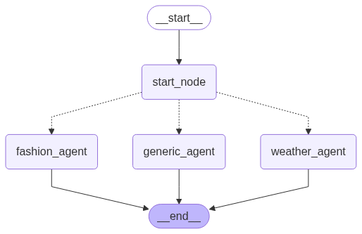

# ML TASKS
## This repo contains two tasks made for the ML coding club
## The project report is almost built in into the jupyter notebooks itself, but i will make them formally in PDF format and upload by26th May EOD
# Task 1
## Data Imputation and Feature Analysis Project

This project focuses on cleaning a dataset, imputing missing values, and identifying key features using exploratory data analysis (EDA) techniques. It leverages both simple statistical methods and machine learning tools such as KNN Imputer to handle missing data and assess feature relationships.

## Files
- `task1.ipynb`: The main Jupyter Notebook with the complete analysis.
- `datastud.csv`: Dataset used.
- `requirements_1.txt` : Requirement file

## Objectives
- Impute missing values in a dataset using multiple strategies.
- Analyze relationships between features to infer possible labels.
- Use encoding techniques compatible with distance-based algorithms like KNN.

## Methods Used
- Missing value imputation using:
  - Mode for categorical columns
  - Mean and KNN Imputer for numerical columns
- Encoding categorical variables using `pd.get_dummies`
- Exploratory Data Analysis (EDA):
  - Correlation heatmap
  - Pair plots
- Visualization tools: Matplotlib, Seaborn

## Observations
- Mean and KNN Imputer gave similar results due to a small proportion of missing data.
- One-hot encoding was avoided due to incompatibility with KNN distances.
- KNN turned out to be the best model for predictions. It gave an accuracy of around 72 percent.
## Libraries Used
- `pandas`
- `numpy`
- `matplotlib`
- `seaborn`
- `sklearn`

## Author
- Pranav Prabhu Kumble

---------

#Task 2

# Task 2  
## Weather Mind – Modular LLM Agent Framework

This project implements a modular AI assistant framework using Langgraph that dynamically delegates user queries to specialized agents or tools. It integrates weather APIs, maintains conversational context, and provides a flexible architecture for extending AI capabilities.

---

## Files

- `weather_mind.ipynb`: Main notebook implementing the agent framework and tool integrations.
- `requirements_2.txt`: Lists Python dependencies required to run the notebook.
- `.env` / `dotenv-example.txt`: Specifies environment variables including API keys.
- `weather_mind_multi_agent.ipynb`: Contains alternate apporach and was an attempt to the Level4 task. However, it could not be completed fully before the timeline 

---

## Objectives

- Create a modular assistant that can switch between specialized agents.
- Handle fallback queries through a generic AI agent.
- Connect to external APIs like OpenWeatherMap for real-time data.
- Maintain session state and context through LangChain's message framework.

---

## Methods Used

- **AI Agents**:
  - `generic_agent`: Handles general queries using role-based context.
  - `weather_agent`: Uses a tool which invokes OpenWeatherMap API to fetch real-time weather. This agent also falls back on the LLM when the weather API is unable to get the right response
  - `fashion_agent`: Dummy implementation with a dummy fashion specialist tool. 
- **Tool for weather details using Geolocation & API Integration**:
  - Uses `geopy` and custom `extract_location` to resolve user input locations.
  - Sends HTTP requests to fetch current weather data.
- **State Management**:
  - Stores conversation history and query metadata using LangChain Core.   

---

## Observations

- The assistant can dynamically respond using role context ("assistant", "weather expert", etc.).
- Agent modularity allows new tools (e.g., fashion, finance) to be plugged in.
- Weather agent successfully uses `geopy` + OpenWeatherMap to give accurate weather details.

---

## Example Environment Variables
- `dotenv-example.txt` file

---

## Libraries Used

- `langchain-core`
- `langgraph`, `langsmith`
- `geopy`
- `requests`
- `python-dotenv`
- `orjson`, `protobuf`, `httpx`
- `ipykernel`, `ipython`, `jupyter`
- `matplotlib-inline`, `Pygments` *(for notebook visualization)*

## Author

- Pranav Prabhu Kumble

---------

